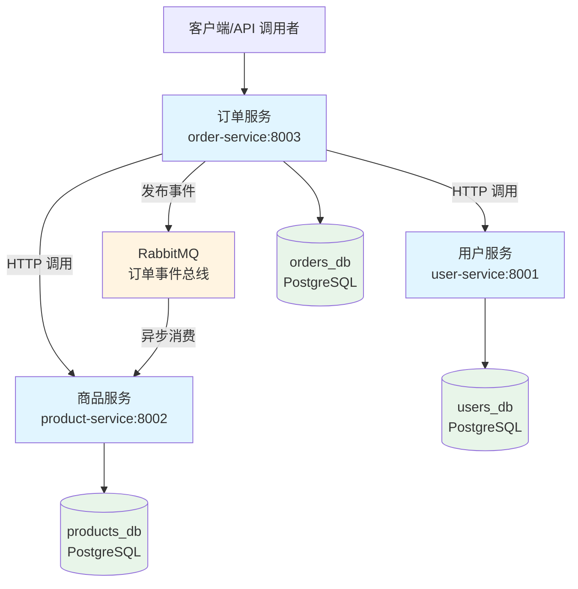

# Microshop Microservices

一个面向学习/作品集的 Python 微服务示例，展示了“可上线”的工程化实践：独立数据库、服务间 API 调用、RabbitMQ 事件驱动、容错重试、Docker Compose 一键启动。

## 🏗️ 架构图



### 核心流程：下单 → 事件 → 扣库存

1. **客户端调用订单服务**：`POST /api/orders`
2. **订单服务同步校验**：
   - HTTP 调用用户服务验证用户存在
   - HTTP 调用商品服务验证库存充足
3. **订单服务写入本地数据库**：`orders_db`
4. **订单服务发布事件**：通过 RabbitMQ 发布 `ORDER_CREATED` 事件
5. **商品服务异步消费**：监听 RabbitMQ，收到事件后扣减库存（`products_db`）

**为什么这样设计？**
- **解耦**：订单服务不需要等待库存扣减完成，提高响应速度
- **最终一致性**：即使商品服务暂时不可用，订单已创建，库存稍后扣减
- **可扩展**：未来可以轻松添加其他消费者（如通知服务、统计服务）

## 📚 What You'll Learn

通过这个项目，你将理解并实践：

### 1. 微服务数据自治（Database per Service）
- 每个服务拥有独立的数据库，避免跨服务直接访问数据
- 通过 API 和事件进行服务间通信，而不是共享数据库

### 2. 事件驱动架构（Event-Driven Architecture）
- 使用 RabbitMQ 实现异步事件发布/订阅
- 理解最终一致性：订单创建和库存扣减是异步的

### 3. 服务间通信的容错设计
- **超时保护**：防止下游服务挂起导致请求被卡住
- **自动重试**：网络抖动时自动重试，提高成功率
- **错误分类**：区分业务错误（404）和系统错误（500/超时），返回合适的 HTTP 状态码

### 4. Docker Compose 多容器编排
- 一键启动完整的微服务环境（数据库、消息队列、业务服务）
- 理解容器间网络通信和服务依赖

### 5. 可观测性（Observability）
- 结构化日志记录每次服务间调用的详细信息
- 记录调用耗时、状态码，便于快速定位问题

## 🏗️ 架构速览

| 服务            | 端口 | 负责内容                                   | 数据库          |
|-----------------|------|--------------------------------------------|-----------------|
| user-service    | 8001 | 用户注册、查询、登录                       | `users_db`      |
| product-service | 8002 | 商品 CRUD、监听订单事件扣减库存           | `products_db`   |
| order-service   | 8003 | 下单、调用用户/商品服务校验并发布订单事件 | `orders_db`     |
| PostgreSQL      | 5432 | 通过 `db-init/init-microshop-dbs.sql` 初始化三个库 | - |
| Redis           | 6379 | 预留（后续可做缓存/限流）                  | - |
| RabbitMQ        | 5672/15672 | 订单事件总线（fanout exchange）          | - |

特点：

- **数据自治**：每个业务服务只访问自己的数据库，通过 API/事件交流。
- **容错通信**：订单服务调用下游时使用 httpx + tenacity，带超时、重试、日志。
- **事件驱动库存**：下单后只发布事件，商品服务异步扣库存 → 体现最终一致性。
- **可观测性**：结构化日志记录调用耗时、事件处理成功/失败。
- **Docker Compose**：`docker compose up -d --build` 即可模拟整套微服务。

## 快速开始

```bash
# 1. 启动 Docker Desktop（或任何兼容 Docker 环境）

# 2. 拉起所有服务
docker compose up -d --build

# 3. 验证健康检查
curl http://localhost:8001/health
curl http://localhost:8002/health
curl http://localhost:8003/health
```

### 选装：只重建业务镜像

```bash
docker compose build order-service product-service
docker compose up -d order-service product-service
```

## 手动演练：订单 → 事件 → 扣库存

```bash
# 1. 创建用户
curl -Method POST http://localhost:8001/api/users `
  -ContentType "application/json" `
  -Body '{ "email": "user1@example.com", "name": "User1", "password": "123456" }'

# 2. 创建商品（库存 50 件）
curl -Method POST http://localhost:8002/api/products/ `
  -ContentType "application/json" `
  -Body '{ "name": "MacBook Pro", "description": "demo product", "price": 12999.0, "stock": 50 }'

# 3. 创建订单（quantity=3）
curl -Method POST http://localhost:8003/api/orders `
  -ContentType "application/json" `
  -Body '{ "user_id": 1, "product_id": 1, "quantity": 3 }'

# 4. 查询商品库存 → 47（由商品服务消费 RabbitMQ 事件后扣减）
curl http://localhost:8002/api/products/1
```

## 目录结构

```
.
├─docker-compose.yml           # 一键启动 DB + MQ + 3 个服务
├─db-init/init-microshop-dbs.sql  # 初始化 users_db / products_db / orders_db
├─user-service/                # FastAPI + SQLAlchemy（用户）
├─product-service/             # FastAPI + SQLAlchemy + RabbitMQ 消费者（商品）
├─order-service/               # FastAPI + RabbitMQ 事件发布（订单）
└─.gitignore
```

## 🧪 Testing

### 运行测试

```bash
# 安装测试依赖
pip install pytest pytest-asyncio httpx

# 运行所有测试
pytest

# 运行特定服务的测试
pytest user-service/tests/
pytest order-service/tests/
pytest product-service/tests/
```

### 测试覆盖

- **Unit Tests**：测试业务逻辑（如订单创建、库存扣减）
- **Integration Tests**：测试服务间 HTTP 调用和事件消费
- **E2E Tests**：使用 Docker Compose 启动完整环境，测试端到端流程

> 💡 **提示**：测试用例正在完善中，欢迎贡献！

### CI/CD

项目使用 GitHub Actions 进行持续集成：

- 每次 push 自动运行 pytest
- 验证 Docker 镜像构建
- 检查代码格式和基本语法

查看 `.github/workflows/ci.yml` 了解详情。

## 🚀 进阶方向

- ✅ **已完成**：独立数据库、事件驱动、容错重试、Docker Compose
- 🔄 **进行中**：单元测试、集成测试、CI/CD
- 📋 **计划中**：
  - Redis 缓存/幂等性：订单接口传 `request_id`，用 Redis 保证“不重复扣款”
  - 链路追踪：接入 OpenTelemetry/Jaeger，实现分布式追踪
  - API 网关：拆分出 auth-service，演示统一鉴权
  - 监控告警：Prometheus + Grafana 监控服务健康度

## License

MIT

